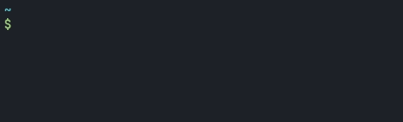

# jalm

> Generate Progress Bars from Cron Expressions



## Installation and Usage

Grab the latest binary from the
[Github Actions](https://github.com/neelkarma/jalm/actions) tab.

Alternatively, to build from source, install the Rust Toolchain and then

```sh
cargo install --git https://github.com/neelkarma/jalm.git
```

After that, you can use the `jalm <CRON_EXPR>` command to run jalm. The cron
expression format is `sec min hour day(month) month day(week) year`.

Use the `--help` flag for options.

## Why "jalm"?

**J**ust **a** **l**ittle **m**ore...
